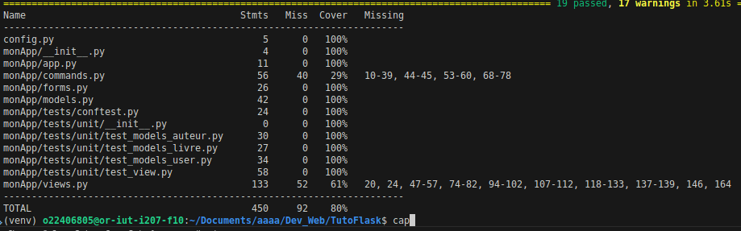

# R3.01 DÉVELOPPEMENT WEB - Projet TutoFlask
---
## Comment lancer l'app :

1. Cloner le dépôt GitHub : `git clone https://github.com/louismaillet/Dev_Web.git `
2. Aller dans le dossier du projet : `cd Dev_Web/TutoFlask`
3. Créer un environnement virtuel : `python -m venv venv`
4. Activer l'environnement virtuel : `source venv/bin/activate`
5. Installer les dépendances : `pip install -r requirements.txt`
6. Lancer l'application : `flask run`
7. Ouvrir un navigateur et aller à l'adresse : `http://127.0.0.1:5000`

## Résumé première séance

- Création d’un environnement virtuel pour gérer les dépendances Python sans conflit.
- Installation de Flask et configuration de l’application.
- Mise en place d’une architecture claire pour structurer le projet.
- Création du fichier requirements.txt pour lister toutes les dépendances.
- Premiers pas avec Flask et les routes, pour comprendre comment l’application répond aux requêtes.
- Initiation à la création de pages web dynamiques en Python.

---

## Résumé deuxième séance :

- Nous avons vu comment connecter Flask à une base de données via SQLAlchemy.  
- Nous avons créé des modèles Python représentant les tables de la base.  
- Nous avons appris à peupler automatiquement la base à partir d’un fichier YAML.  
- Nous avons utilisé Flask Shell pour afficher, récupérer, modifier et supprimer des données.  

---

## Résumé troisième séance :

- Nous avons vu comment mettre en relation une page HTML et CSS avec Python et Flask.  
- Nous avons découvert la notion de template, un fichier HTML qui peut recevoir des variables depuis Python.  
- Nous avons compris le rôle des vues (views.py) qui définissent le contenu renvoyé pour chaque URL.  

---

## Résumé quatrième séance :

QCM 9.5/10 puis absent car problème de santé

---

## Résumé cinquième séance :

- Nous avons vu comment afficher des images stockées dans le dossier static.  
- Nous avons appris à créer un template de base base.html pour réutiliser une structure sur plusieurs pages.  
- Nous avons vu comment mettre en place des URL dynamiques, comme index?name=test.  
- Nous avons appris à créer des tableaux HTML avec des images, pratique pour lister des livres ou des auteurs.  
- Nous avons appliqué Bootstrap et CSS pour améliorer la navigation, la mise en page et la présentation des tableaux.  

## Résumé sixième séance :

- Nous avons utilisé WTForms pour créer des formulaires sécurisés avec protection CSRF.  
- Nous avons créé des formulaires pour ajouter, modifier, consulter et supprimer des auteurs (FormAuteur).  
- Nous avons mis en place les vues correspondantes :  
  - updateAuteur(idA) pour modifier un auteur  
  - saveAuteur() pour sauvegarder les modifications  
  - viewAuteur(idA) pour consulter un auteur  
  - createAuteur() pour afficher le formulaire de création  
  - insertAuteur() pour valider la création  
  - deleteAuteur(idA) pour afficher la suppression  
  - eraseAuteur() pour valider la suppression  

- Puis en autonomie, nous avons créé des formulaires similaires pour les livres (FormLivre) et les vues associées :  
  - updateLivre(idL)  
  - saveLivre()  
  - viewLivre(idL)
  pour pouvoir mofidier le prix d'un livre   

--- 

## Résumé septième séance :

- Fin du TP6 
- Nous avons pu voir comment cree un utilisateur 
- Nous avons cree le fait de s'authentifier avec des identifiant qu'on a pu cree et modifier 
- Nous avons vu comment proteger des routes pour que seul les utilisateurs authentifiés puissent y accéder et que les autres soient redirigés vers la page de connexion
- Nous avons aussi vu comment afficher les boutons modifier, creer, supprimer uniquement si l'utilisateur est connecté
- Nous avons vu comment afficher le nom de l'utilisateur connecté dans la barre de navigation
- Nous avons vu comment se deconnecter

---

## Résumé final :

- J'ai finis le projet j'ai pu ajouter la fonctionnalité de voir les livres d'un auteur en cliquant sur voir l'auteur 
- J'ai aussi ajouté la fonctionnalité de modifier le prix, un titre, l'url et l'auteur en mettant un menu déroulant pour choisir l'auteur

mon pourcentage de coverage est de 80% : 

[]

je me suis arreté a 80% car le reste des tests sont presque identiques a ceux que j'ai fait.